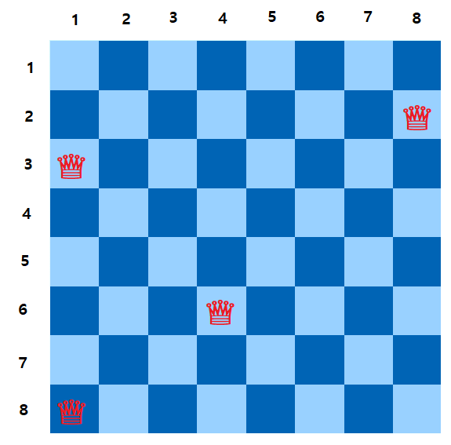

## 풀이 날짜
2023-06-14

## 문제
https://school.programmers.co.kr/learn/courses/30/lessons/12952

## 어려웠던 점
N-Queen 문제는 백트래킹 기법으로 풀 수 있는 대표적인 문제이다.  
백트래킹 기법은 현재 탐색하고 있는 노드가 유망하다면 계속 진행하고, 유망하지 않다면 더 이상 탐색하지 않도록 구현해야 하는데 **유망함을 판별하는 조건을 어떻게 작성할 것인지**를 생각하는 게 가장 어려웠다.  

고민도 하고 여러 자료도 찾아보는 과정에서 [이 영상](https://youtu.be/z4wKvYdd6wM?t=388)을 보고 N-Queen 문제에서의 유망함을 판별하는 조건에 대해서 이해하게 되었다.  

## 아이디어
### 변수 정의
먼저 `queens` 배열과 `row` 의 값을 다음과 같이 정리하자:  
- **row**: 단일 정수 값으로, 현재 진행중인 행을 나타낸다.  
- **queens[row]**: 해당 인덱스(행)에서 퀸을 배치한 열을 나타낸다.  

### 예시
  

예를 들어서 8x8 의 체스판에 위와 같은 위치에 퀸이 놓여져 있다고 해보자.  
이런 경우에는 `queens` 배열에 들어 있는 원소의 값은 다음과 같다.  
- **queens[2]**: 8 (2행 8열에 퀸이 존재)  
- **queens[3]**: 1 (3행 1열에 퀸이 존재)  
- **queens[6]**: 4 (6행 4열에 퀸이 존재)  
- **queens[8]**: 1 (8행 1열에 퀸이 존재)  


### 유망함 조건
퀸은 행, 열, 대각선으로 나란히 존재해서는 안되는데,  
이 조건을 계산하는 방법은 다음과 같다.  

- **행(row)**  
`backtrack()` 함수에서 특정 `row` 에 대해 `n` 번 반복하면서 퀸이 놓인 열을 `col` 로 놓기 때문에 반복문 차원에서 조건이 검사되므로 추가적으로 작성할 조건문은 존재하지 않는다.  
- **열(column)**  
`queens[row]` 배열은 `row` 행에 존재하는 퀸의 열을 나타내기 때문에, `queens` 배열에 들어있는 원소 중에서 중복되어 있는 값이 존재하면 안된다.  
따라서 `promising()` 함수에서 `queens[row] === queens[i]` 조건으로 표현한다.  
- **대각선**  
퀸이 놓인 두 좌표에서 행과 열의 차이가 동일하다면 대각선에 존재하는 것이다.  
따라서 `promising()` 함수에서 `Math.abs(queens[row] - queens[i]) === row - i` 조건으로 표현한다.  
> - `queens[6] - queens[3]` 의 값은 `3` 이다.  
행의 차이 `6-3` 와 열의 차이 `4-1` 의 값이 동일하므로 대각선에 존재한다.  
> - `queens[6] - queens[2]` 의 값은 `-4` 이다.  
  행의 차이 `6-2` 와 열의 차이 `4-8` 의 값이 동일하므로 대각선에 존재한다. 물론, 음수의 값이 나올 수 있으므로 절대값으로 변환해서 사용해야 한다.  

### 소스코드
```js
function promising(queens, row) {
  for (let i = 0; i < row; i++) {
    if (queens[row] === queens[i] || Math.abs(queens[row] - queens[i]) === row - i) return false;
  }

  return true;
}

// queens[row]: 해당 인덱스(행)에서 퀸을 배치한 열
// row: 현재 탐색중인 행
function backtrack(queens, row) {
  const n = queens.length;
  let count = 0;

  if (row === n) return 1;

  for (let col = 0; col < n; col++) {
    queens[row] = col;
    if (!promising(queens, row)) continue;
    count += backtrack(queens, row + 1);
  }

  return count;
}

function solution(n) {
  return backtrack(Array.from({ length: n }, () => 0), 0);
}
```

### 참고 자료
프로그래머스 데브코스  
[파이썬으로 배우는 알고리즘 기초: 19. n-Queens 문제의 구현](https://www.youtube.com/watch?v=z4wKvYdd6wM)  